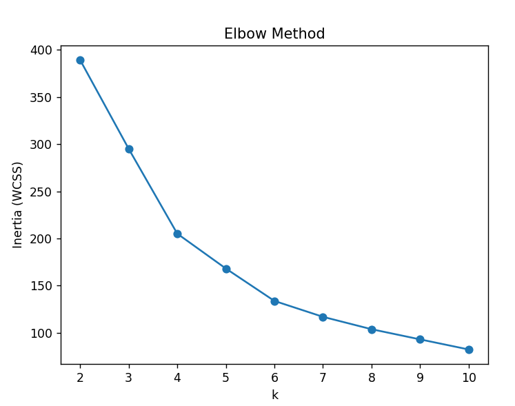

# Customer Segmentation (K-Means)

## Steps
1. Load dataset with pandas
2. Select numeric features (drop CustomerID)
3. Handle missing values (median fill)
4. Scale with StandardScaler
5. Run K-Means for k = 2..10
6. Plot Elbow + Silhouette
7. Choose best k and justify

## How to run
```bash
pip install -r requirements.txt
python main.py
```

## Conclusion:

1. The optimal number of clusters is chosen based on the highest silhouette score and supported by the elbow method.
2. The Elbow method shows a clear bend around k = 5, where the decrease in inertia starts to slow down significantly.
3. This indicates that adding more clusters after k = 5 does not significantly improve the model.
4. Therefore, the optimal number of clusters is chosen as k = 5.



## Notes
1. Dataset: Mall Customers (Kaggle)
2. Put Mall_Customers.csv in the project folder before running.

## Author
Sana Saleh
